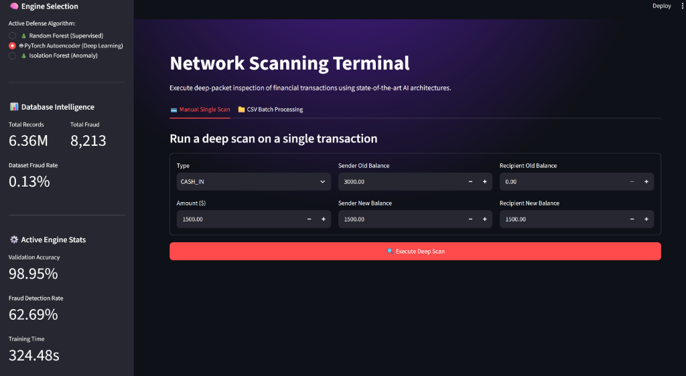
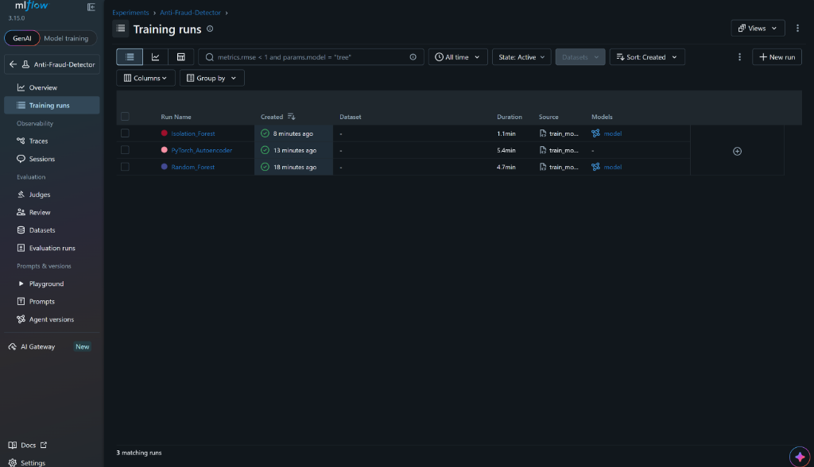

# 🛡️ AI Fraud Sentinel

A complete, production-ready Multi-Model Cybersecurity Dashboard designed to detect anomalous financial transactions in massive datasets using a combination of supervised and unsupervised machine learning algorithms.

*(Demonstrating the PyTorch Deep Learning engine interface)*

*(Live neural network metric tracking via MLflow)*

## 🚀 Features

- **Automated Data Pipeline**: Silently pulls the massive 500MB+ [Kaggle PaySim Database](https://www.kaggle.com/datasets/sriharshaeedala/financial-fraud-detection-dataset) without requiring API keys or manual downloads.
- **Hardware-Aware Neural Engine**: The system dynamically scans your motherboard at install time. It automatically configures itself for **NVIDIA CUDA** or **Intel XPU (Arc)** hardware acceleration, seamlessly falling back to standard CPU if no supported GPU is found.
- **Experiment Tracking**: Fully integrated with **MLflow** for real-time tracking of neural network epochs, validation accuracy, and fraud detection rates during the build sequence.
- **Deep Packet Inspection UI**: A custom, dark-mode, glassmorphism UI built with **Streamlit** featuring live AI engine metrics, deep-scan simulations, and threat topography scatter plots.
- **Automated Environment Management**: The entire system is modularized and launched securely via `start_interface.bat`. It will automatically construct an isolated **Conda** environment (or fallback to a Python `venv`) so your global system remains untouched.

## 🧠 3-Model AI Architecture

This project employs three distinct AI philosophies to battle financial fraud, which you can hot-swap in real-time from the dashboard:

1. 🌲 **Random Forest (Supervised Classification)**: Learns from known fraudulent transaction rules and splits data perfectly. Highly accurate. We utilize `class_weight='balanced'` to massively penalize missing fraud.
   - *Image: [Random Forest Engine](assets/random_forest.png)*
2. 🤖 **PyTorch Autoencoder (Deep Learning)**: A custom PyTorch `nn.Module` neural network trained exclusively on "safe" transactions. It attempts to mathematically reconstruct transactions and flags high "reconstruction errors" as anomalies.
3. 🌲 **Isolation Forest (Tree-Based Anomaly)**: Scalable unsupervised anomaly detection that builds random decision trees to isolate out-of-bounds data quickly.
   - *Image: [Isolation Forest Engine](assets/iso_forest.png)*

## 📊 Live System Intelligence

The models are trained locally on a 6.3 Million row financial dataset. Below are the training and evaluation statistics:

### Database Stats (PaySim)
* **Total Records Analyzed**: 6,362,620
* **Total Fraudulent Transactions**: 8,213
* **Dataset Fraud Rate**: 0.13%

### AI Performance Metrics
| AI Engine | Validation Accuracy | Fraud Detection Rate (Recall) | Training Time |
| :--- | :--- | :--- | :--- |
| **Random Forest** | 99.54% | **97.75%** | 269.24s |
| **PyTorch Autoencoder** | 98.95% | 62.69% | 324.48s |
| **Isolation Forest** | 85.01% | 62.45% | 56.99s |

*Note: Since fraud is incredibly rare (0.13%), Unsupervised Anomaly Detection models (Autoencoder, Isolation Forest) naturally have lower recall without aggressive threshold tuning, while the Supervised model (Random Forest) excels by learning exactly what fraud looks like.*

## 💻 How to Run Locally

1. Clone this repository.
2. Double-click the **`start_interface.bat`** file.
3. The system will automatically construct an isolated Conda (or standard venv) environment, configure your specific GPU hardware acceleration, download the 500MB Kaggle dataset, rapidly train all 3 AI models, and boot both the MLflow Tracking Server and the web dashboard in your browser.
